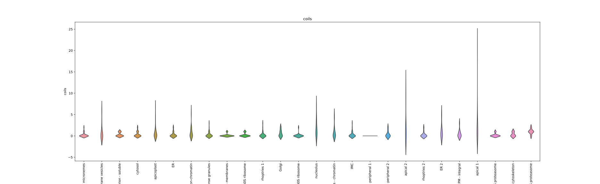

# Logistig Regression Models on Spatial Proteomics Data

## Introduction
Apicomplexan parasites cause major human disease and food insecurity. They owe their considerable success to highly specialized cell compartments and structures. These adaptations drive their recognition, nondestructive penetration, and elaborate reengineering of the host’s cells to promote their growth, dissemination, and the countering of host defenses. The evolution of unique apicomplexan cellular compartments is concomitant with vast proteomic novelty. Consequently, half of apicomplexan proteins are unique and uncharacterized.

## Background
In 2020, [Barylyuk *et al*](https://www.cell.com/cell-host-microbe/fulltext/S1931-3128(20)30514-X) determined the steady-state subcellular location of thousands of proteins simultaneously within the globally prevalent apicomplexan parasite *Toxoplasma gondii*. Thus providing unprecedented comprehensive molecular definition of these unicellular eukaryotes and their specialized compartments.


The assignment of the subcellular location was performed combining the output of high-throughput mass spectrometry and machine-learning clustering. This method however, relies on proteins that can be detected using mass spectrometry. Therefore, despite that *Toxoplasma gondii* encodes 8200 proteins in its genome, only 3832 proteins could be detected using mass spectrometry, and 3823 could be assigned a subcellullar compartment.

## Genomic, proteomic, and composition features
Considering the vast amount of information encoded in the genome sequence of *Toxoplasma gondii*, we think we could apply clustering and classification methods to infer the subcellular localization of such proteins using genomic, proteomic and composition features like %G+C, codon bias, presence of transmembrane helices, disordered regions, etc.

## Genome and protein sequences, data availability
All sequences employed in this notebook were downloaded from [ToxoDB](https://toxodb.org), we only kept proteins encoded in chromosome-level resolved sequences (n=8200). We then calculated %G+C and codon usage from the coding sequences; and physicochemical properties of the proteins using [EMBOSS](http://emboss.sourceforge.net/). Transmembrane helices were predicted using [tmhmm](http://www.cbs.dtu.dk/services/TMHMM/). Disordered regions and other conserved domains were predicted using [InterProScan](https://www.ebi.ac.uk/interpro/search/sequence/). All the predictions and experimental results were combined into a [tsv file](Toxoplasma_gondii_ME49.tsv) for further processing using pandas and scikit learn

- [Genome sequence](Toxoplasma_gondii_ME49.fasta.gz)
- [Gene sequences](Toxoplasma_gondii_ME49.ffn.gz)
- [Protein sequences](Toxoplasma_gondii_ME49.faa.gz)
- [Final dataset](Toxoplasma_gondii_ME49.tsv.gz)
- [Jupyter notebook](Logistic_Regression_Models_on_Spatial_Proteomics_Data.ipynb)

## Data structure

|Column|Description|Column|Description|Column|Description|Column|Description|Column|Description|
|------|-----------|------|-----------|------|-----------|------|-----------|------|-----------|
|**accession**|Protein identifier|**product**|Protein product description|**markers**|Subcellular **known** location|**lopit**|Subcellular **predicted** location|**toxo_exclusive**|Proteins shared with other organisms or exclusive to *Toxoplasma gondii*|
|**sequence**|Chromosome encoding the protein|**start**|Coding sequence start|**end**|Coding sequence end|**strand**|Coding sequence strand|||
|**cds_length**|Coding sequence length|**cds_gc**|Coding sequence %G+C|||||||
|**prot_weight**|Protein mass|**prot_length**|Protein length|**charge**|Protein charge|**iep**|Isoelectric point|||
|**tiny**|Fraction of tiny aminoacids|**small**|Fraction of small aminoacids|**aliphatic**|Fraction of aliphatic aminoacids|**aromatic**|Fraction of aromatic aminoacids|||
|**nonpolar**|Fraction of nonpolar aminoacids|**polar**|Fraction of polar aminoacids|**charged**|Fraction of charged aminoacids|**basic**|Fraction of basic aminoacids|**acid**|Fraction of acidic aminoacids|
|**coils**|Number of coiled coil regions|**disordered**|Number of disordered regions|**tmh**|Number of transmembrane helices|||||
|**Columns 28-89**|Codons used per protein|||||||||


```python
import pandas as pd
import matplotlib.pyplot as plt
import seaborn as sns
from sklearn.linear_model import LogisticRegression
from sklearn.metrics import classification_report
df = pd.read_csv("Toxoplasma_gondii_ME49.tsv.gz",sep="\t")
df.set_index("accession",drop=True,inplace=True)
```

## Logistic model #1
### Codon usage might be a good measure to detect genes with a shared evolutionary background
All proteins are made up from 20 essential aminoacids, however such aminoacids might be encoded by different codons. Organisms whose DNA has a high %G+C use different sets of codons to optimize protein synthesis than organisms with low %G+C.

In 2020, [Barylyuk *et al*](https://www.cell.com/cell-host-microbe/fulltext/S1931-3128(20)30514-X), classified the proteins of *Toxoplasma gondii* as exclusive to Toxoplasma (no orthologues detected) or shared (orthologues detected), thus, we could use such classifications to train a model based on the codon usage of the genes encoding the aforementioned proteins.

### Definitions: The genetic code


```python
genetic_code={
    "Ala":["GCA","GCC","GCG","GCT"],
    "Cys":["TGC","TGT"],
    "Asp":["GAC","GAT"],
    "Glu":["GAA","GAG"],
    "Phe":["TTC","TTT"],
    "Gly":["GGA","GGC","GGG","GGT"],
    "His":["CAC","CAT"],
    "Ile":["ATA","ATC","ATT"],
    "Lys":["AAA","AAG"],
    "Leu":["CTA","CTC","CTG","CTT","TTA","TTG"],
    "Met":["ATG"],
    "Asn":["AAC","AAT"],
    "Pro":["CCA","CCC","CCG","CCT"],
    "Gln":["CAA","CAG"],
    "Arg":["AGA","AGG","CGA","CGC","CGG","CGT"],
    "Ser":["AGC","AGT","TCA","TCC","TCG","TCT"],
    "Thr":["ACA","ACC","ACG","ACT"],
    "Val":["GTA","GTC","GTG","GTT"],
    "Trp":["TGG","TGA"],
    "Tyr":["TAC","TAT"]}
```


```python
!mkdir -p "orthology"
```


```python
toxo_df = df.copy()
toxo_df = toxo_df[toxo_df["toxo_exclusive"]==True]
fig, axes = plt.subplots(4,5,figsize=(25,20))
title_str = "Codon usage, exclusive genes"
fig.suptitle(title_str,size="xx-large")
counter_1 = 0
counter_2 = 0
for amino in genetic_code.keys():      
    sns.violinplot(ax=axes[counter_1,counter_2],data=toxo_df[genetic_code[amino]],inner=None,cut=0)
    axes[counter_1,counter_2].set_title(amino)
    counter_2 += 1
    if counter_2%5 == 0:
        counter_2 = 0
        counter_1 += 1
file_name = "orthology/exclusive.svg"
plt.savefig(file_name)
#plt.show()
plt.close()
```


```python
shared_df = df.copy()
shared_df = shared_df[shared_df["toxo_exclusive"]==False]
fig, axes = plt.subplots(4,5,figsize=(25,20))
title_str = "Codon usage, shared genes"
fig.suptitle(title_str,size="xx-large")
counter_1 = 0
counter_2 = 0
for amino in genetic_code.keys():      
    sns.violinplot(ax=axes[counter_1,counter_2],data=shared_df[genetic_code[amino]],inner=None,cut=0)
    axes[counter_1,counter_2].set_title(amino)
    counter_2 += 1
    if counter_2%5 == 0:
        counter_2 = 0
        counter_1 += 1
file_name = "orthology/shared.svg"
plt.savefig(file_name)
#plt.show()
plt.close()
```

## Finding #1
### There are differences in codon usage among exclusive and shared genes
|Shared genes                   |Exclusive genes                   |
|-------------------------------|----------------------------------|
|||

## Logistic model #1:
- We selected only the aminoacids with different codon usage patterns (Cys, Glu, Phe, His, Lys, Asn, Gln and Tyr) as potential predictors
- Our target variable is `toxo_exclusive`
- The model seems to accurately predict whether a gene is shared or exclusive based on the codon usage

However... the model was tested against the same dataset, a more stringent test could be performed using data from a different organism


```python
aminoacids = genetic_code["Cys"] + genetic_code["Glu"] + genetic_code["Phe"] + genetic_code["His"] + genetic_code["Lys"] + genetic_code["Asn"] + genetic_code["Gln"] + genetic_code["Tyr"]
codon_df = df.copy()
training_df = codon_df.copy()
training_df = training_df.sample(n=5700, random_state=1)
X = training_df[aminoacids]
y = training_df["toxo_exclusive"]
model = LogisticRegression(max_iter=1000)
model.fit(X, y);
y_true = codon_df["toxo_exclusive"]
X_test = codon_df[aminoacids]
y_pred = model.predict(X_test)
print(classification_report(y_true, y_pred))
```

                  precision    recall  f1-score   support

           False       0.93      0.99      0.96      7509
            True       0.54      0.13      0.21       691

        accuracy                           0.92      8200
       macro avg       0.73      0.56      0.59      8200
    weighted avg       0.89      0.92      0.89      8200


## Logistic model #2 & #3
### Protein composition might be related to subcellular localization
Subcellular compartments have specific physicochemical properties that allow only certain proteins to be targeted to such compartments, however there are no strict rules for this targeting process. By incorporating different metrics of protein composition, we might be able to predict subcellular location having two training sets:
1. Proteins which location is known (`markers` column)
2. Proteins which location is predicted using LOPIT (`lopit` column)


```python
aminoacids ={
    "tiny"     :["A","C","G","S","T"],
    "small"    :["A","C","D","G","N","P","S","T","V"],
    "aliphatic":["A","I","L","V"],
    "aromatic" :["F","H","W","Y"],
    "nonpolar" :["A","C","F","G","I","L","M","P","V","W","Y"],
    "polar"    :["D","E","H","K","N","Q","R","S","T"],
    "charged"  :["D","E","H","K","R"],
    "basic"    :["H","K","R"],
    "acid"     :["D","E"]}
```


```python
!mkdir -p features_1
```

### Distribution of the protein properties in training set 1


```python
training_df_1 = df.copy()
training_df_1 = training_df_1[training_df_1["markers"]!="unknown"]
feature_list=["charge","iep","tiny","small","aliphatic","aromatic","nonpolar","polar","charged","basic","acid","coils","disordered","tmh"]
for feature in feature_list:
    fig, ax = plt.subplots(figsize=(26,8))
    sns.violinplot(data=training_df_1,x="markers",y=feature,inner=None)
    ax.tick_params(axis='x',rotation=90)
    ax.set_title(feature)
    ax.set_xlabel('')
    file_name = "features_1/"+feature+".svg"
    plt.savefig(file_name)
    #plt.show()
    plt.close()
```

|Tiny                                  |Small                                   |                                    |                              |
|:------------------------------------:|:--------------------------------------:|:----------------------------------:|:----------------------------:|
|          |          |                                    |                              |
|**Aliphatic**                         |**Aromatic**                            |**Charged**                         |                              |
||    |  |                              |
|**Acidic**                            |**Basic**                               |**Nonpolar**                        |**Polar**                     |
|          |          |||
|**Coils**                             |**Disordered regions**                  |**Transmembrane helices**           |                              |
|        ||          |                              |
|**Isoelectric point**                 |**Charge**                              |                                    |                              |
|            |        |                                    |                              |


```python
!mkdir -p features_2
```


```python
training_df_2 = df.copy()
training_df_2 = training_df_2[training_df_2["lopit"]!="unknown"]
feature_list=["charge","iep","tiny","small","aliphatic","aromatic","nonpolar","polar","charged","basic","acid","coils","disordered","tmh"]
for feature in feature_list:
    fig, ax = plt.subplots(figsize=(26,8))
    sns.violinplot(data=training_df_2,x="markers",y=feature,inner=None)
    ax.tick_params(axis='x',rotation=90)
    ax.set_title(feature)
    ax.set_xlabel('')
    file_name = "features_2/"+feature+".svg"
    plt.savefig(file_name)
    #plt.show()
    plt.close()
```

|Tiny                                  |Small                                   |                                    |                              |
|:------------------------------------:|:--------------------------------------:|:----------------------------------:|:----------------------------:|
|          |          |                                    |                              |
|**Aliphatic**                         |**Aromatic**                            |**Charged**                         |                              |
||    |  |                              |
|**Acidic**                            |**Basic**                               |**Nonpolar**                        |**Polar**                     |
|          |          |||
|**Coils**                             |**Disordered regions**                  |**Transmembrane helices**           |                              |
|        ||          |                              |
|**Isoelectric point**                 |**Charge**                              |                                    |                              |
|            |        |                                    |                              |

## Logistic model #2 & #3
The constructed models have poor predictive value despite having experimental evidence supporting the initial classification.


```python
feature_list=["charge","iep","tiny","small","aliphatic","aromatic","nonpolar","polar","charged","basic","acid","coils","disordered","tmh"]
training_df_1 = df.copy()
training_df_1 = training_df_1[training_df_1["markers"]!="unknown"]

training_df_2 = df.copy()
training_df_2 = training_df_2[training_df_2["lopit"]!="unknown"]

testing_df = df.copy()
testing_df = testing_df[testing_df["lopit"]=="unknown"]

X_1 = training_df_1[feature_list]
y_1 = training_df_1["markers"]
model_1 = LogisticRegression(max_iter=100000)
model_1.fit(X_1, y_1)

X_2 = training_df_2[feature_list]
y_2 = training_df_2["lopit"]
model_2 = LogisticRegression(max_iter=100000)
model_2.fit(X_2, y_2)

X_test_1 = training_df_1[feature_list]
y_true_1 = training_df_1["markers"]
y_pred_1_1 = model_1.predict(X_test_1)
y_pred_1_2 = model_2.predict(X_test_1)

X_test_2 = training_df_2[feature_list]
y_true_2 = training_df_2["lopit"]
y_pred_2_1 = model_1.predict(X_test_2)
y_pred_2_2 = model_2.predict(X_test_2)

X_test_3 = testing_df[feature_list]
y_pred_3_1 = model_1.predict(X_test_3)
y_pred_3_2 = model_2.predict(X_test_3)

print(classification_report(y_true_1, y_pred_1_1))
print("========="*14)
print(classification_report(y_true_1, y_pred_1_2))
print("========="*14)
print(classification_report(y_true_2, y_pred_2_1))
print("========="*14)
print(classification_report(y_true_2, y_pred_2_2))
print("========="*14)
print(y_pred_3_1)
```

                               precision    recall  f1-score   support

               19S proteasome       0.36      0.29      0.32        14
               20S proteasome       0.64      0.50      0.56        14
                 40S ribosome       0.37      0.33      0.35        21
                 60S ribosome       0.71      0.84      0.77        38
                           ER       0.50      0.40      0.44        30
                         ER 2       0.60      0.33      0.43         9
                        Golgi       0.64      0.35      0.45        20
                          IMC       0.33      0.37      0.35        38
                PM - integral       0.71      0.92      0.80        13
            PM - peripheral 1       0.79      0.88      0.84        43
            PM - peripheral 2       0.50      0.20      0.29        10
                     apical 1       0.48      0.41      0.44        29
                     apical 2       0.33      0.08      0.13        12
                   apicoplast       0.36      0.41      0.38        49
                      cytosol       0.41      0.69      0.51        62
               dense granules       0.33      0.32      0.32        41
        endomembrane vesicles       0.33      0.23      0.27        13
                   micronemes       0.52      0.45      0.48        29
    mitochondrion - membranes       0.39      0.39      0.39        36
      mitochondrion - soluble       0.39      0.38      0.38        32
                    nucleolus       0.27      0.20      0.23        15
          nucleus - chromatin       0.56      0.64      0.60        39
      nucleus - non-chromatin       0.25      0.27      0.26        55
                  rhoptries 1       0.54      0.45      0.49        33
                  rhoptries 2       0.83      0.36      0.50        14
         tubulin cytoskeleton       0.50      0.11      0.18         9

                     accuracy                           0.46       718
                    macro avg       0.49      0.42      0.43       718
                 weighted avg       0.47      0.46      0.45       718

    ==============================================================================================================================
                               precision    recall  f1-score   support

               19S proteasome       0.00      0.00      0.00        14
               20S proteasome       0.00      0.00      0.00        14
                 40S ribosome       1.00      0.19      0.32        21
                 60S ribosome       0.72      0.87      0.79        38
                           ER       0.40      0.63      0.49        30
                         ER 2       0.00      0.00      0.00         9
                        Golgi       0.17      0.05      0.08        20
                          IMC       0.42      0.13      0.20        38
                PM - integral       0.48      0.85      0.61        13
            PM - peripheral 1       0.91      0.72      0.81        43
            PM - peripheral 2       0.00      0.00      0.00        10
                     apical 1       1.00      0.03      0.07        29
                     apical 2       0.00      0.00      0.00        12
                   apicoplast       0.38      0.06      0.11        49
                      cytosol       0.24      0.87      0.37        62
               dense granules       0.31      0.24      0.27        41
        endomembrane vesicles       0.00      0.00      0.00        13
                   micronemes       0.89      0.28      0.42        29
    mitochondrion - membranes       0.35      0.33      0.34        36
      mitochondrion - soluble       0.25      0.44      0.31        32
                    nucleolus       1.00      0.07      0.12        15
          nucleus - chromatin       0.24      0.72      0.35        39
      nucleus - non-chromatin       0.34      0.33      0.33        55
                  rhoptries 1       0.00      0.00      0.00        33
                  rhoptries 2       1.00      0.07      0.13        14
         tubulin cytoskeleton       0.00      0.00      0.00         9

                     accuracy                           0.35       718
                    macro avg       0.39      0.26      0.24       718
                 weighted avg       0.42      0.35      0.30       718

    ==============================================================================================================================
                               precision    recall  f1-score   support

               19S proteasome       0.10      0.24      0.14        17
               20S proteasome       0.10      0.50      0.17        14
                 40S ribosome       0.22      0.36      0.27        28
                 60S ribosome       0.60      0.82      0.69        40
                           ER       0.33      0.22      0.27       247
                         ER 2       0.16      0.24      0.19        17
                        Golgi       0.23      0.09      0.13       153
                          IMC       0.17      0.31      0.22        95
                PM - integral       0.35      0.23      0.28       135
            PM - peripheral 1       0.29      0.80      0.42        49
            PM - peripheral 2       0.06      0.05      0.05        44
                     apical 1       0.11      0.37      0.17        59
                     apical 2       0.07      0.12      0.09        17
                   apicoplast       0.12      0.29      0.17       168
                      cytosol       0.43      0.31      0.36       599
               dense granules       0.20      0.18      0.19       191
        endomembrane vesicles       0.07      0.12      0.09        34
                   micronemes       0.20      0.40      0.27        55
    mitochondrion - membranes       0.28      0.32      0.30       193
      mitochondrion - soluble       0.30      0.22      0.25       274
                    nucleolus       0.08      0.12      0.09        32
          nucleus - chromatin       0.54      0.39      0.46       769
      nucleus - non-chromatin       0.26      0.19      0.22       461
                  rhoptries 1       0.20      0.25      0.23        71
                  rhoptries 2       0.16      0.14      0.15        51
         tubulin cytoskeleton       0.09      0.11      0.10         9

                     accuracy                           0.28      3822
                    macro avg       0.22      0.28      0.23      3822
                 weighted avg       0.33      0.28      0.29      3822

    ==============================================================================================================================


    /usr/lib64/python3.6/site-packages/sklearn/metrics/_classification.py:1221: UndefinedMetricWarning: Precision and F-score are ill-defined and being set to 0.0 in labels with no predicted samples. Use `zero_division` parameter to control this behavior.
      _warn_prf(average, modifier, msg_start, len(result))


                               precision    recall  f1-score   support

               19S proteasome       0.00      0.00      0.00        17
               20S proteasome       0.00      0.00      0.00        14
                 40S ribosome       0.56      0.18      0.27        28
                 60S ribosome       0.61      0.85      0.71        40
                           ER       0.39      0.49      0.43       247
                         ER 2       0.00      0.00      0.00        17
                        Golgi       0.26      0.09      0.14       153
                          IMC       0.18      0.09      0.12        95
                PM - integral       0.41      0.34      0.37       135
            PM - peripheral 1       0.60      0.65      0.63        49
            PM - peripheral 2       0.00      0.00      0.00        44
                     apical 1       0.25      0.05      0.08        59
                     apical 2       0.00      0.00      0.00        17
                   apicoplast       0.44      0.10      0.16       168
                      cytosol       0.38      0.67      0.48       599
               dense granules       0.29      0.15      0.20       191
        endomembrane vesicles       0.00      0.00      0.00        34
                   micronemes       0.58      0.25      0.35        55
    mitochondrion - membranes       0.34      0.30      0.32       193
      mitochondrion - soluble       0.33      0.35      0.34       274
                    nucleolus       0.33      0.03      0.06        32
          nucleus - chromatin       0.43      0.63      0.51       769
      nucleus - non-chromatin       0.40      0.30      0.34       461
                  rhoptries 1       0.00      0.00      0.00        71
                  rhoptries 2       1.00      0.02      0.04        51
         tubulin cytoskeleton       0.00      0.00      0.00         9

                     accuracy                           0.39      3822
                    macro avg       0.30      0.21      0.21      3822
                 weighted avg       0.37      0.39      0.35      3822

    ==============================================================================================================================
    ['cytosol' 'micronemes' 'rhoptries 1' ... 'dense granules'
     'dense granules' '20S proteasome']
